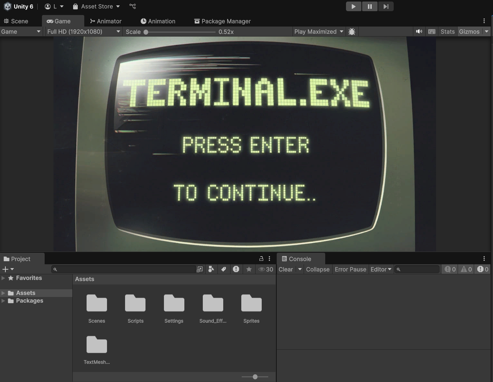
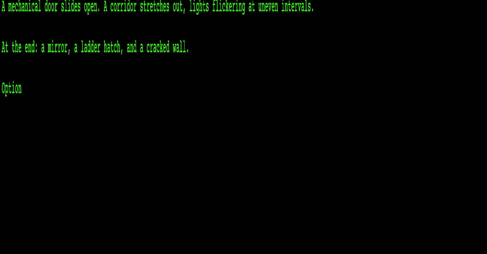
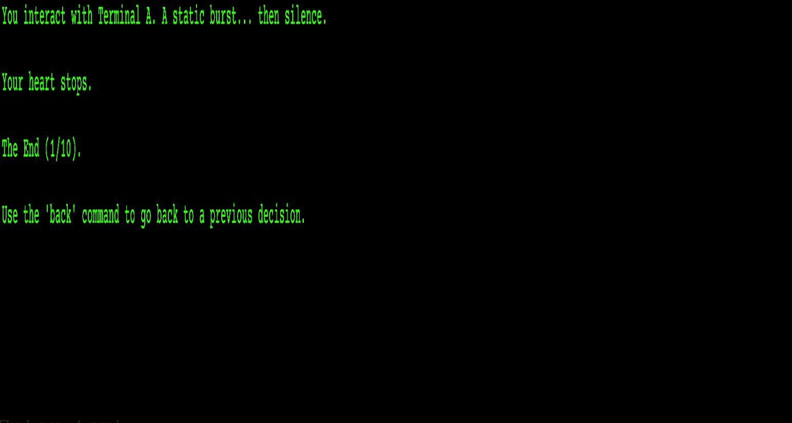
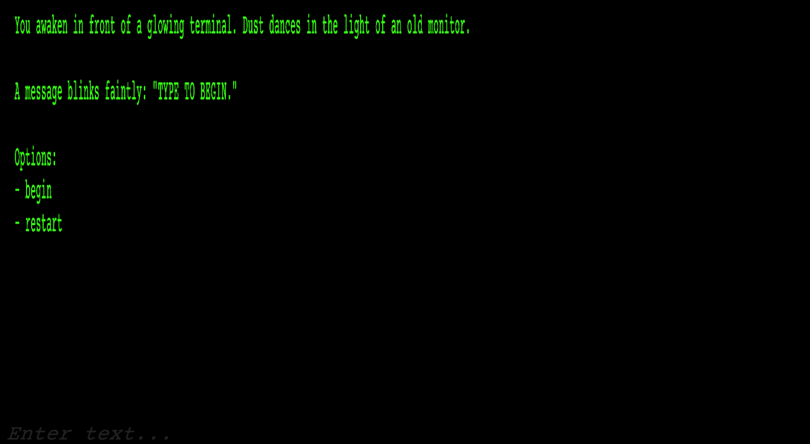

<h2 align="center">░▒▓█  T E R M I N A L . E X E  █▓▒░</h2>

<i>A retro horror terminal adventure in text and terror.</i>

<h2>🕹 ABOUT</h2>

<b><code>terminal.exe</code></b> is a chilling <b>terminal-based psychological horror game</b> made in Unity. 
The screen flickers. You type. The terminal answers. Will you survive its memory?

<blockquote>
Navigate only by typing commands. 
Every path is a story. Every ending, a warning.
</blockquote>

<h2>🎮 FEATURES</h2>

<ul>
  <li>⌨️ Full keyboard-controlled gameplay</li>
  <li>💀 10 mysterious, branching endings</li>
  <li>🔊 Retro <b>typing sound effects</b></li>
  <li>📜 Typewriter-style story reveal</li>
  <li>🔁 Go <code>back</code> to the last decision</li>
  <li>❌ No traditional UI — only scripts and text</li>
  <li>🚪 Seamless scene transitions via keystrokes</li>
</ul>

<h2>💻 HOW TO PLAY</h2>

<table>
  <thead>
    <tr>
      <th>Command</th>
      <th>Function</th>
    </tr>
  </thead>
  <tbody>
    <tr>
      <td><code>begin</code></td>
      <td>Starts your journey</td>
    </tr>
    <tr>
      <td><code>back</code></td>
      <td>Go back to previous state</td>
    </tr>
    <tr>
      <td><code>restart</code></td>
      <td>Restart the game</td>
    </tr>
    <tr>
      <td><code>quit</code></td>
      <td>Exit game (build only)</td>
    </tr>
  </tbody>
</table>

<blockquote>
Type carefully. Clues may be hidden in the text. 
Some choices may lock you into an ending.
</blockquote>

<h2>🔧 INSTALLATION</h2>

<ol>
  <li>Clone or download this repository.</li>
  <li>Open the project in <b>Unity 2021 or later</b>.</li>
  <li>Press <b>Play</b> or build the game for your OS.</li>
  <li>Stare into the glow of <code>terminal.exe</code>...</li>
</ol>

<h2>🛠 DEVELOPMENT</h2>

<ul>
  <li><b>Engine</b>: Unity (C#)</li>
  <li><b>Font</b>: Courier/Terminal-style via TMP</li>
  <li><b>Sound</b>: Free mechanical key sounds</li>
  <li><b>No UI</b>: Entirely script-driven interface</li>
</ul>

Scripts used:

<ul>
  <li><code>TerminalGame.cs</code> — Core game logic and story handling</li>
  <li><code>SoundManager.cs</code> — Plays typing & input sounds</li>
  <li><code>StoryNode.cs</code> — Data structure for text branches</li>
</ul>

<h2>📖 TIPS</h2>

<ul>
  <li>Use <code>back</code> if you regret a choice.</li>
  <li>Try different keywords — some are unexpected.</li>
  <li>Find all 10 endings to complete the story.</li>
</ul>

<h2>⚠️ CONTENT WARNING</h2>

This game contains:

<ul>
  <li>Psychological horror</li>
  <li>Claustrophobic themes</li>
  <li>Existential dread</li>
</ul>

<i>Please play at your own discretion.</i>

<h2>🧟 CREDITS</h2>

<ul>
  <li>👾 <b>Code & Design</b>: [Your Name]</li>
  <li>💬 <b>Inspiration</b>: Retro terminal systems, SCP, analog horror</li>
  <li>🔊 <b>Sounds</b>: Free sound libraries (freesound.org, etc.)</li>
  <li>🧠 <b>Special thanks</b>: You, the curious player</li>
</ul>

<h2>💾 VERSION</h2>

<pre><code>terminal.exe v1.0.0</code></pre>

<h2>▶️ PLAY & SHARE</h2>

Check out and play <b>terminal.exe</b> on itch.io: 
<a href="https://lucifer-playz.itch.io/terminalexe"><b>https://lucifer-playz.itch.io/terminalexe</b></a>

<h2>📸 SCREENSHOTS</h2>

<table>
  <tr>
    <td></td>
    <td></td>
    <td></td>
    <td></td>
  </tr>
</table>

<blockquote>
<b>"Welcome back, user. 
You never left."</b>  
— <code>terminal.exe</code>
</blockquote>
